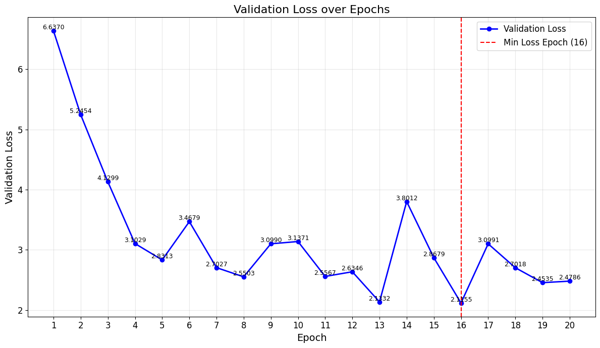

# Machine Translation: English to Hindi Using Transformers

This project implements a transformer-based neural network architecture from scratch using PyTorch for machine translation between English and Hindi. The model is trained on the IIT Bombay English-Hindi Parallel Corpus to translate English sentences into Hindi.


## Table of Contents

- [Introduction](#introduction)
- [Dataset](#dataset)
- [Model Architecture](#model-architecture)
- [Installation](#installation)
- [Results](#results)
- [Further Improvements](#Further-Improvements)
- [References](#references)

## Introduction

Machine Translation (MT) is the task of automatically converting text from one language to another. This project focuses on building a transformer-based model to translate English sentences into Hindi. Transformers have become the standard architecture for most NLP tasks, including machine translation, due to their efficiency in capturing dependencies in sequential data.

## Dataset

We use the **Helsinki-NLP/opus-100 en-hi Dataset**, which contains around **538K** sentence pairs with their corresponding translations in both languages. The dataset consists of formal translations in various domains such as health, tourism, and general topics.

- **Source Language**: English
- **Target Language**: Hindi
- **Dataset Link**: [Helsinki-NLP/opus-100](https://huggingface.co/datasets/Helsinki-NLP/opus-100/viewer/en-hi)

### Preprocessing

- Tokenization of both English and Hindi sentences using word-level tokenizers.
- Sequence padding and truncation to handle varying sentence lengths.
- Vocabulary creation and encoding for both languages.

## Model Architecture

The project implements the **Transformer** model from scratch in PyTorch. Key components of the transformer architecture include:

1. **Multi-Head Attention**: Enables the model to attend to different parts of the sequence simultaneously. Used in the form of Masked Multi Head Attention and Cross Attention in Decoder through slight modification.
2. **Positional Encoding**: Adds information about the position of words in the sequence.
3. **Feed-Forward Networks**: Non-linear transformation of attention output.
4. **Layer Normalization**: Stabilizes the training and speeds up convergence.

### Model Details

- **Number of Layers**: 6 layers for both encoder and decoder.
- **Heads in Attention Mechanism**: 8
- **Hidden Size**: 512
- **Dropout**: 0.1 for regularization.
- **Optimizer**: Adam 

## Installation

### Requirements

- Python 3.8+
- PyTorch 1.8+
- TorchText
- Numpy
- tensorboard
- tokenizers
- Datasets

To install the necessary packages, run:

```bash
pip install -r requirements.txt
```

## Results

The model was evaluated using the Character Error Rate, Word Error Rate and BLEU score to measure translation accuracy. 

After training, the model achieved : 
- **Character Error Rate:** 0.25051334500312805
- **Word Error Rate:** 0.4615384638309479
- **BLEU Score:** 0.07438015937805176



Example translations:
    SOURCE: I'll go with you.
    TARGET: मैं तुम्हारे साथ जाना होगा.
 PREDICTED: मैं आप के साथ जा रहा हूँ .
--------------------------------------------------------------------------------
    SOURCE: A significant number of people have been blaming two main political leaders for all the vice of Bangladesh.
    TARGET: बांग्लादेश की सारी समस्या के लिए बहुत से लोग दो मुख्य राजनीतिक दल के नेताओं पर दोषारोपण करते रहे हैं.
 PREDICTED: बांग्लादेश की सारी समस्या के लिए बहुत से लोग दो मुख्य राजनीतिक दल के नेताओं पर नज़र रखी गई .
--------------------------------------------------------------------------------
    SOURCE: Allah originates the creation, then He will bring it back, then you will be brought back to Him.
    TARGET: ख़ुदा ही ने मख़लूकात को पहली बार पैदा किया फिर वही दुबारा (पैदा करेगा) फिर तुम सब लोग उसी की तरफ लौटाए जाओगे
 PREDICTED: ख़ुदा ही ने मख़लूकात को पहली बार पैदा किया फिर वही दुबारा ( पैदा करेगा ) फिर तुम सब लोग उसी की तरफ लौटाए जाओगे
--------------------------------------------------------------------------------
    SOURCE: Was it not a proof for them that the learned men of Israel knew about this?
    TARGET: क्या यह उनके लिए कोई निशानी नहीं है कि इसे बनी इसराईल के विद्वान जानते है?
 PREDICTED: क्या यह उनके लिए कोई निशानी नहीं है कि इसे बनी इसराईल के विद्वान जानते है ?
--------------------------------------------------------------------------------
    SOURCE: Timeout for marking message as seen.
    TARGET: देखे गये के रूप में संदेश चिह्नित करने के लिए समय समाप्ति.
 PREDICTED: देखे गये के रूप में संदेश चिह्नित करने के लिए समय समाप्ति .


## Further-Improvements

- The following model was trained till 20 epochs. The performance can be increased by improving the number of epochs and introducing early stopping so that our model does not overfit
- As the dataset is huge only 20% of the data(~58k) is used for training and validation due to limited resources. The performance can be further improved by using the entire dataset.

## References

- [Attention is All You Need](https://arxiv.org/abs/1706.03762)
- [The Annotated Transformer](https://nlp.seas.harvard.edu/2018/04/03/attention.html)
- [IIT Bombay English-Hindi Corpus](https://www.cfilt.iitb.ac.in/iitb_parallel/)